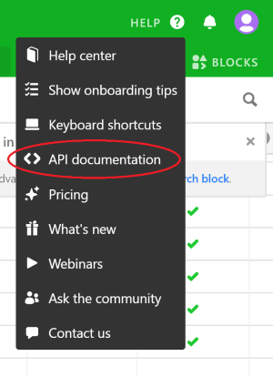
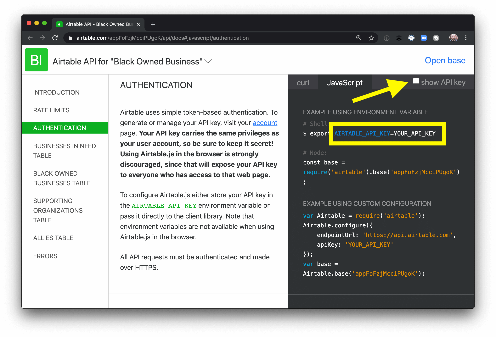
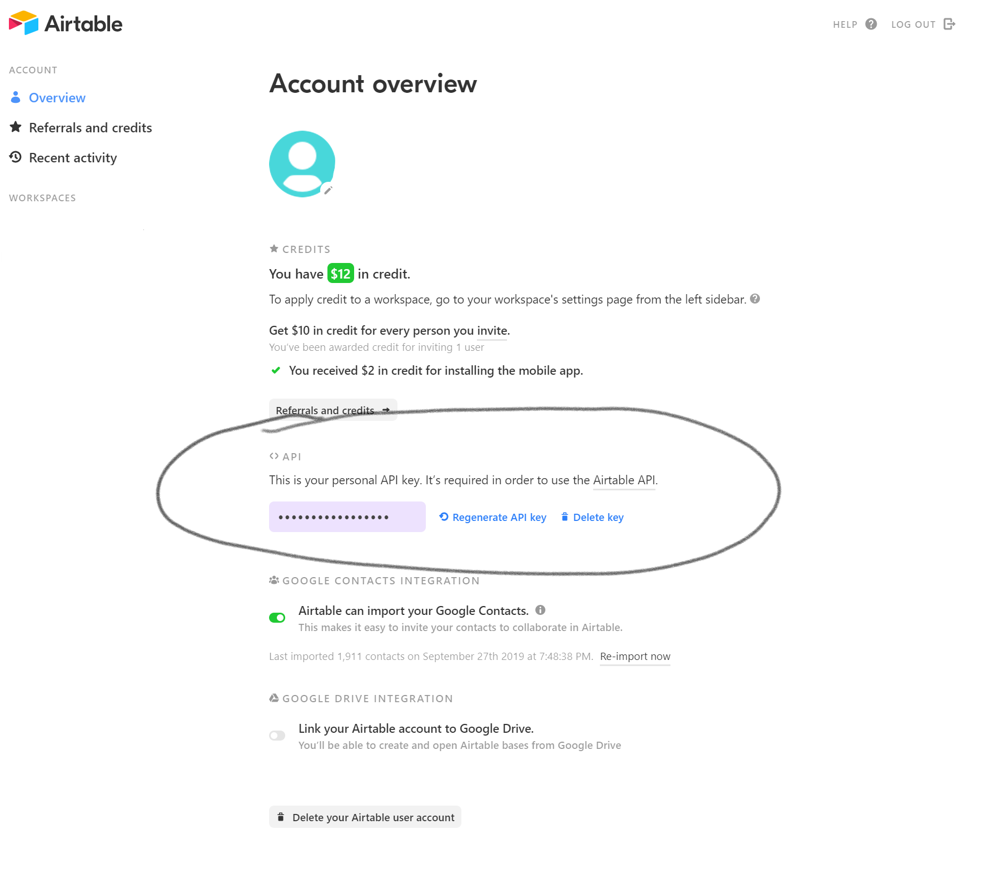

<h1 align="center">Welcome to Rebuild Black Business 👋</h1>
<p>
  
</p>

> The website for https://www.rebuildblackbusiness.com/

### 🏠 [Homepage](https://www.rebuildblackbusiness.com/)

## 🤝 Contributing

Contributions, issues and feature requests are welcome!<br />Feel free to check [issues page](https://github.com/Rebuild-Black-Business/RBB-Website/issues).

### How can I get involved now?

The first step is to make sure that you've sign up as a volunteer at http://join.rebuildblackbusiness.com/ indicating your interested in contributing and reviewed our [Code of Conduct](https://github.com/Rebuild-Black-Business/RBB-Website/blob/master/CODE_OF_CONDUCT.md). This will get you access to our Discord development channels for further information.

If you see a [GitHub Issues](https://github.com/Rebuild-Black-Business/RBB-Website/issues) you're interested in working on, comment on the task expressing your interest. A project manager will assign the task to you.

### Branch Name Conventions

When contributing, please fork this repository by clicking the “fork” button at the top right. This creates your own copy of the repository where you’re able to make changes. Once you have forked the repository, please structure your branches using the following format.

`feature/task-description` - Feature branches are for all new feature work. The task description should be descriptive enough to quickly understand the work done in this branch. Please keep your features concise and ensure the work done in this branch directly relates to your task.

`fix/task-description` - Fix branches should be leveraged for bug fixes on existing features

`hotfix/task-description` - Hotfix branches should only ever be leveraged for _critical_ bug fixes that need attention immediately. This would only be use if there is a broken feature or bug on production that needs to be addressed urgently.

### Pull Requests

To send your changes for review, open a pull request. If you’ve never opened a pull request before, [read Thanoshan’s article on creating a pull request](https://www.freecodecamp.org/news/how-to-make-your-first-pull-request-on-github-3/) for more information!

Code reviewers will automatically be notified for a review.

## Terminology

- Data Types - Dynamic user-generated data for the various types of data used on the site. Currently this includes the following
  - Business In Need
  - Black Owned Business
  - Service Organization
  - Ally

## 🖥️ Tech Details

**Frontend**

The website is built using [Gatsby](https://www.gatsbyjs.org/docs/), with UI components leveraging [Chakra UI](https://chakra-ui.com/getting-started) with custom theming for rapid and consistent component driven development. Unit tests are written with the [React-Testing-Library](https://github.com/testing-library/react-testing-library)

**Data**

Data for the various user types is stored in [Airtable](https://airtable.com/). Each user type has it's own table that the site pulls from and displays.

To get access to this data, sign up as a volunteer at http://join.rebuildblackbusiness.com/ to get access to the Rebuild Black Business Discord and express your interest in helping on Discord to your assigned Team Lead. They'll get you read access to the data in a timely manner.

## Install

**Clone the repository**

First, fork this repository by clicking the “fork” button at the top right. This creates your own copy of the repository where you’re able to make changes.

Second, clone your copy of the repo to your local machine:

```sh
# clone the repo
git clone git@github.com:YOUR_USERNAME_HERE/RBB-Website.git
# move into the new folder
cd RBB-Website/
# install dependencies
npm install
```

**Add environment variables**

This site uses Airtable to keep track of business data. We have set up a dummy database that mirrors the production database that you can get access to by signing up for Airtable via this link: https://airtable.com/invite/l?inviteId=invMvhnrpHMbuDNHe&inviteToken=50cc562d70779ebf8db6109fb31046358875f0c5c2d7b37143d433e56a9f9177

Upon clicking the above link, you will get "Read Only" access to the database.

Once you've obtained access, grab your API key clicking on HELP button in the upper right hand corner Airtable, and clicking the "API Documentation" link.



Check the “show API key” box at the top-right, then look for yours in the code sample displayed next to the “Authentication” docs.



_Note:_ If you don't see this checkbox, make sure you're logged in to Airtable, and go to [your account settings page](https://airtable.com/account) to generate a key:



Once you have your API key, create a file called `.env` and add your API key:

```bash
GATSBY_AIRTABLE_API_KEY=YOUR_API_KEY
```

> **NOTE:** See `.env.EXAMPLE` for a copy-pasteable template to get set up!

### Airtable Base ID

Additionally, the `.env.EXAMPLE` file has the `GATSBY_AIRTABLE_BASE_ID` pre-defined for you. This ID references the dummy database mentioned above. Copy and paste that directly into your newly created `.env` file as well.

If you ever lose the base ID for the dummy database, it is `appkenjGlBB01wr3i`.

### Search

We have a PHP backend setup for search, it does not have an API key as of right now however not too much of an issue as it is a public API anyway.

The search endpoint needs to be set in .env.development as Gatsby uses this method to seperate out environment variables that are loaded on the frontend from the rest.

Please ask for the endpoint when running locally (also check pinned messages).

## Cloudinary

CLOUD_NAME=rebuild-black-business

Our cloud name is used for every call to our `useImage` hook. Having this on hand will be useful.

For our search functionality, we're making use of serverless functions through Netlify.

To test locally, you're going to want to set up the [Netlify CLI](https://docs.netlify.com/cli/get-started/#installation) and run

```bash
  netlify dev
```

This will allow you to consume the env variables from our Netlify account and perform hits to our serverless functions (currently only search)

## Usage

Now that you’ve got the files and an API key, you can start the site on your machine!

```bash
npm run develop
```

This will start Gatsby and show you a local development URL. Whenever you make code changes, Gatsby will automatically reload the browser to show you your changes.

To stop the development server, press `control + C` in your terminal.

### Troubleshooting

If `npm run develop` throws an error like:

```
ERROR #85923  GRAPHQL

There was an error in your GraphQL query:

Cannot query field "allAirtableResources" on type "Query".
```

this is likely due to misconfigured environemnt variables for that particular resource (i.e., Airtable API key is missing or invalid). To resolve this issue you can double-check that you've followed the env setup instructions in this README or ask for help in Discord.

## Run tests

```sh
npm run test
```

## Author

👤 **Rebuild Black Business**

- Github: [@Rebuild-Black-Business](https://github.com/Rebuild-Black-Business)

## Legal

© 2020 0x42 Software Engineering, LLC. All rights reserved.

## Contributors ✨

Thanks goes to these wonderful people ([emoji key](https://allcontributors.org/docs/en/emoji-key)):

<!-- ALL-CONTRIBUTORS-LIST:START - Do not remove or modify this section -->
<!-- prettier-ignore-start -->
<!-- markdownlint-disable -->
<table>
  <tr>
    <td align="center"><a href="https://www.aboutmonica.com/"><br /><sub><b>Monica Powell</b></sub></a><br /><a href="https://github.com/Rebuild-Black-Business/RBB-Website/commits?author=M0nica" title="Code">💻</a></td>
    <td align="center"><a href="http://dommagnifi.co/"><br /><sub><b>Dominic Magnifico</b></sub></a><br /><a href="https://github.com/Rebuild-Black-Business/RBB-Website/commits?author=magnificode" title="Code">💻</a></td>
    <td align="center"><a href="https://juanri0s.github.io/"><br /><sub><b>Juan</b></sub></a><br /><a href="https://github.com/Rebuild-Black-Business/RBB-Website/commits?author=juanri0s" title="Code">💻</a></td>
    <td align="center"><a href="https://mikebifulco.com/"><br /><sub><b>Mike Bifulco</b></sub></a><br /><a href="https://github.com/Rebuild-Black-Business/RBB-Website/commits?author=mbifulco" title="Code">💻</a></td>
    <td align="center"><a href="https://www.richardhaines.dev/"><br /><sub><b>Richard Haines</b></sub></a><br /><a href="https://github.com/Rebuild-Black-Business/RBB-Website/commits?author=molebox" title="Code">💻</a></td>
    <td align="center"><a href="https://github.com/racedale"><br /><sub><b>Dale Race</b></sub></a><br /><a href="https://github.com/Rebuild-Black-Business/RBB-Website/commits?author=racedale" title="Code">💻</a></td>
    <td align="center"><a href="https://ryanharris.dev/"><br /><sub><b>Ryan Harris</b></sub></a><br /><a href="https://github.com/Rebuild-Black-Business/RBB-Website/commits?author=ryancharris" title="Code">💻</a></td>
  </tr>
  <tr>
    <td align="center"><a href="https://github.com/asaki444"><br /><sub><b>Aditi</b></sub></a><br /><a href="https://github.com/Rebuild-Black-Business/RBB-Website/commits?author=asaki444" title="Code">💻</a></td>
    <td align="center"><a href="https://github.com/jakeleboeuf"><br /><sub><b>Jake LeBoeuf</b></sub></a><br /><a href="https://github.com/Rebuild-Black-Business/RBB-Website/commits?author=jakeleboeuf" title="Code">💻</a></td>
    <td align="center"><a href="https://github.com/llexical"><br /><sub><b>Lizzie</b></sub></a><br /><a href="https://github.com/Rebuild-Black-Business/RBB-Website/commits?author=llexical" title="Code">💻</a></td>
    <td align="center"><a href="https://github.com/shapirone"><br /><sub><b>shapirone</b></sub></a><br /><a href="https://github.com/Rebuild-Black-Business/RBB-Website/commits?author=shapirone" title="Code">💻</a></td>
    <td align="center"><a href="https://github.com/domitriusclark"><br /><sub><b>Domitrius</b></sub></a><br /><a href="https://github.com/Rebuild-Black-Business/RBB-Website/commits?author=domitriusclark" title="Code">💻</a></td>
    <td align="center"><a href="https://github.com/subject026"><br /><sub><b>Louis Samuel</b></sub></a><br /><a href="https://github.com/Rebuild-Black-Business/RBB-Website/commits?author=subject026" title="Code">💻</a></td>
    <td align="center"><a href="https://chrisbrownie.dev/"><br /><sub><b>Chris</b></sub></a><br /><a href="https://github.com/Rebuild-Black-Business/RBB-Website/commits?author=ChrisBrownie55" title="Code">💻</a></td>
  </tr>
  <tr>
    <td align="center"><a href="https://chances.dev/"><br /><sub><b>Chance Strickland</b></sub></a><br /><a href="https://github.com/Rebuild-Black-Business/RBB-Website/commits?author=chancestrickland" title="Code">💻</a></td>
    <td align="center"><a href="http://jordanandree.com/"><br /><sub><b>Jordan Andree</b></sub></a><br /><a href="https://github.com/Rebuild-Black-Business/RBB-Website/commits?author=jordanandree" title="Code">💻</a></td>
    <td align="center"><a href="https://github.com/QMaximillian"><br /><sub><b>Quinn Lashinsky</b></sub></a><br /><a href="https://github.com/Rebuild-Black-Business/RBB-Website/commits?author=QMaximillian" title="Code">💻</a></td>
    <td align="center"><a href="http://andrewchough.com/"><br /><sub><b>Andrew Chough</b></sub></a><br /><a href="https://github.com/Rebuild-Black-Business/RBB-Website/commits?author=andrewchough" title="Code">💻</a></td>
    <td align="center"><a href="https://github.com/brewswain"><br /><sub><b>Brandon Lee</b></sub></a><br /><a href="https://github.com/Rebuild-Black-Business/RBB-Website/commits?author=brewswain" title="Code">💻</a></td>
    <td align="center"><a href="https://github.com/bcgoss"><br /><sub><b>Bryan Goss</b></sub></a><br /><a href="https://github.com/Rebuild-Black-Business/RBB-Website/commits?author=bcgoss" title="Code">💻</a></td>
    <td align="center"><a href="http://www.jacobbolda.com/"><br /><sub><b>Jacob Bolda</b></sub></a><br /><a href="https://github.com/Rebuild-Black-Business/RBB-Website/commits?author=jbolda" title="Code">💻</a></td>
  </tr>
  <tr>
    <td align="center"><a href="https://github.com/aka-tpayne"><br /><sub><b>Tristan Payne</b></sub></a><br /><a href="https://github.com/Rebuild-Black-Business/RBB-Website/commits?author=aka-tpayne" title="Code">💻</a></td>
    <td align="center"><a href="http://www.chrisdemars.com/"><br /><sub><b>Chris DeMars</b></sub></a><br /><a href="https://github.com/Rebuild-Black-Business/RBB-Website/commits?author=chrisdemars" title="Code">💻</a></td>
    <td align="center"><a href="https://github.com/billy-le"><br /><sub><b>Billy Le</b></sub></a><br /><a href="https://github.com/Rebuild-Black-Business/RBB-Website/commits?author=billy-le" title="Code">💻</a></td>
    <td align="center"><a href="http://www.kieranklaassen.com/"><br /><sub><b>Kieran Klaassen</b></sub></a><br /><a href="https://github.com/Rebuild-Black-Business/RBB-Website/commits?author=kieranklaassen" title="Code">💻</a></td>
    <td align="center"><a href="https://learnwithjason.dev/"><br /><sub><b>Jason Lengstorf</b></sub></a><br /><a href="https://github.com/Rebuild-Black-Business/RBB-Website/commits?author=jlengstorf" title="Code">💻</a></td>
    <td align="center"><a href="https://github.com/mmosholder"><br /><sub><b>Malinda Mosholder</b></sub></a><br /><a href="https://github.com/Rebuild-Black-Business/RBB-Website/commits?author=mmosholder" title="Code">💻</a></td>
    <td align="center"><a href="https://github.com/beattheprose"><br /><sub><b>Alex Jackson</b></sub></a><br /><a href="https://github.com/Rebuild-Black-Business/RBB-Website/commits?author=beattheprose" title="Code">💻</a></td>
  </tr>
  <tr>
    <td align="center"><a href="https://www.marcuslyons.com/"><br /><sub><b>Marcus Lyons</b></sub></a><br /><a href="https://github.com/Rebuild-Black-Business/RBB-Website/commits?author=marcuslyons" title="Code">💻</a></td>
    <td align="center"><a href="https://github.com/dilloncoffman"><br /><sub><b>Dillon Coffman</b></sub></a><br /><a href="https://github.com/Rebuild-Black-Business/RBB-Website/commits?author=dilloncoffman" title="Code">💻</a></td>
    <td align="center"><a href="https://brentmclark.dev/"><br /><sub><b>Brent Clark</b></sub></a><br /><a href="https://github.com/Rebuild-Black-Business/RBB-Website/commits?author=brentmclark" title="Code">💻</a></td>
    <td align="center"><a href="https://jamie.build/"><br /><sub><b>Jamie Kyle</b></sub></a><br /><a href="https://github.com/Rebuild-Black-Business/RBB-Website/commits?author=jamiebuilds" title="Code">💻</a></td>
    <td align="center"><a href="https://github.com/kkemple"><br /><sub><b>Kurt Kemple</b></sub></a><br /><a href="https://github.com/Rebuild-Black-Business/RBB-Website/commits?author=kkemple" title="Code">💻</a></td>
    <td align="center"><a href="http://hublabtt.com"><br /><sub><b>johnpaulanderson</b></sub></a><br /><a href="https://github.com/Rebuild-Black-Business/RBB-Website/commits?author=johnpaulanderson" title="Code">💻</a></td>
  </tr>
</table>

<!-- markdownlint-enable -->
<!-- prettier-ignore-end -->
<!-- ALL-CONTRIBUTORS-LIST:END -->

This project follows the [all-contributors](https://github.com/all-contributors/all-contributors) specification. Contributions of any kind welcome!
